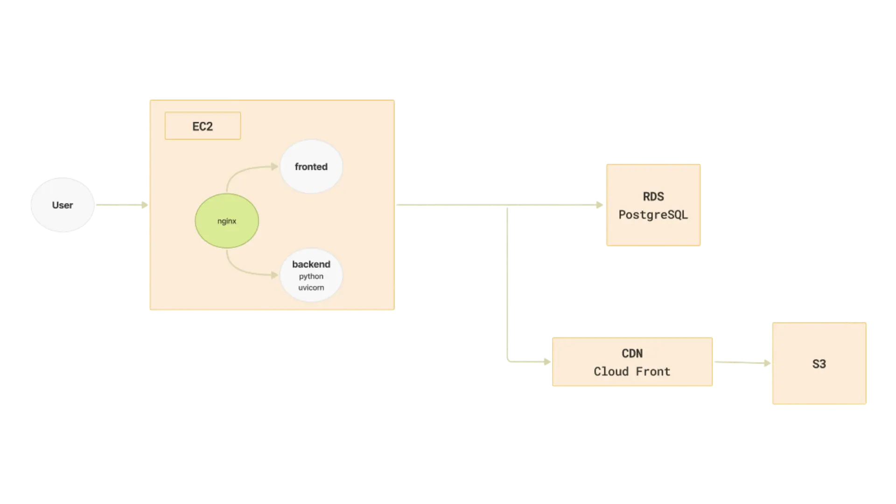

# Mint Journeys


> 一個專為為旅遊而生的記帳網站

Mint Journeys 提供完整的旅遊記帳體驗，包含會員登入、旅程記帳、相片記錄與多人協作功能。

🌐 **Mint Jorneys 線上網站連結：[mintjourneys.com](https://mintjourneys.com)**

---

## ✨ 功能特色

- **會員系統** — 會員以信箱、密碼註冊帳號
- **旅程紀錄** — 設定專屬行程，名稱、多位共同編輯成員
- **多人協作** — 分為自己的行程和共享的行程總覽
- **新增圖片** — 不論是旅程封面圖或是消費紀錄都可以新增圖片

---

## 🛠 技術架構

### Frontend
- React
- TypeScript

### Backend
- Python
- FastAPI 
- SQLAlchemy
- JWT + bcrypt

### Database & Storage
- PostgreSQL
- AWS S3

### Deployment
- AWS EC2
- Nginx
- Docker、Docker Compose

### 系統架構圖



---

## 🗂 專案結構

```
mint-journeys/
├── frontend/
│   └── mint-journeys/
│       ├── public/
│       ├── src/
│       │   ├── main.tsx        # App 入口
│       │   ├── app.tsx         # App 初始化
│       │   ├── routes.tsx      # 路由設定
│       │   ├── pages/          # 頁面（核心功能）
│       │   │   ├── HomePage.tsx
│       │   │   ├── AuthPage.tsx
│       │   │   ├── TripFormPage.tsx
│       │   │   ├── TripDetailPage.tsx
│       │   │   ├── TransactionFormPage.tsx
│       │   │   ├── TransactionDetailPage.tsx
│       │   │   └── ErrorPage.tsx
│       │   ├── styles/         # 樣式
│       │   ├── types/          # 型別定義
│       │   └── assets/         # 圖片 / 靜態資源
│       ├── package.json
│       ├── vite.config.ts
│       ├── nginx.conf
│       └── Dockerfile
│
├── backend/
│   ├── main.py                # FastAPI 入口
│   ├── database.py            # 資料庫連線
│   ├── models/                # 資料模型 / schema
│   │   ├── table_models.py
│   │   ├── schemas.py
│   │   ├── image_service.py
│   │   └── connection_manager.py
│   ├── controllers/           # API 邏輯
│   ├── seed.py                # 測試資料
│   ├── requirements.txt
│   └── Dockerfile
│
└── docker-compose.yml         # 前後端部署設定
```

---

## 🚀 快速開始（本地開發）

### 環境需求

- [Docker](https://www.docker.com/) 與 Docker Compose

### 安裝與啟動

**1. 複製專案**

```bash
git clone https://github.com/shih3807/mint-journeys.git
cd mint-journeys
```

**2. 設定環境變數**

在 `backend/` 目錄下建立 `.env` 檔案（可參考.env.example）：

```env
# PostgreSQL
POSTGRES_USER=""
POSTGRES_PASSWORD=""
POSTGRES_DB=""
POSTGRES_HOST=""
POSTGRES_PORT=""

# JWT
TOKEN_SECRET=""

# AWS S3
AWS_S3_BUCKET_NAME=""
AWS_REGION=""
AWS_ACCESS_KEY_ID=""
AWS_SECRET_ACCESS_KEY=""

CLOUDFRONT_DOMAIN =""
```

**3. 啟動服務**

```bash
docker compose up --build
```

**4. 開啟瀏覽器**

前往 [http://localhost](http://localhost) 即可使用。

| 服務 | 位址 |
|------|------|
| 前端 | http://localhost |
| 後端 API | http://localhost:8000 |
| API 文件 | http://localhost:8000/docs |

---

## 💻 本地開發（不用 Docker）

### 前端

```bash
cd frontend/mint-journeys
npm install
npm run dev
```

### 後端
**1. 設定環境變數**

在 `backend/` 目錄下建立 `.env` 檔案（可參考.env.example）：

```env
# PostgreSQL
POSTGRES_USER=""
POSTGRES_PASSWORD=""
POSTGRES_DB=""
POSTGRES_HOST=""
POSTGRES_PORT=""

# JWT
TOKEN_SECRET=""

# AWS S3
AWS_S3_BUCKET_NAME=""
AWS_REGION=""
AWS_ACCESS_KEY_ID=""
AWS_SECRET_ACCESS_KEY=""

CLOUDFRONT_DOMAIN =""
```

**2. 啟動 uvicorn**
```bash
cd backend
pip install -r requirements.txt
uvicorn main:app --reload
```

---
