# Mint Journeys


> 一個專為旅遊而生的記帳網站

Mint Journeys 提供完整的旅遊記帳體驗，包含會員登入、旅程記帳、相片記錄與多人共同編輯功能。

🌐 **Mint Jorneys 線上網站連結：[mintjourneys.com](https://mintjourneys.com)**


## 🗂️ 目錄

1. [**使用說明**](#-使用說明)
1. [**特色功能**](#-特色功能)
1. [**使用技術**](#-使用技術)
1. [**系統架構圖**](#-系統架構圖)
1. [**圖片上傳流程圖**](#-圖片上傳流程圖)
1. [**資料庫關係圖**](#-資料庫關係圖)
1. [**使用技術**](#-專案結構)
1. [**快速開始本地開發**](#-快速開始本地開發)
1. [**本地開發不用-docker**](#-本地開發不用-docker)

## ✨ 使用說明

1. **註冊與登入** — 註冊帳號，或使用測試帳號登入。
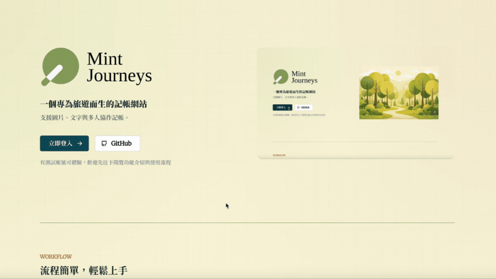

1. **會員首頁** — 登入後，首頁分為自己的旅程與他人共享的旅程，如果被新增進共同編輯旅程，也會有通知。
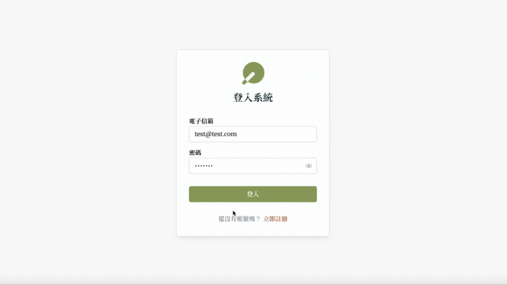

1. **新增旅程** — 建立旅程，可設定時間、幣別、背景圖片，並透過 Email 將旅伴加入共同編輯成員。
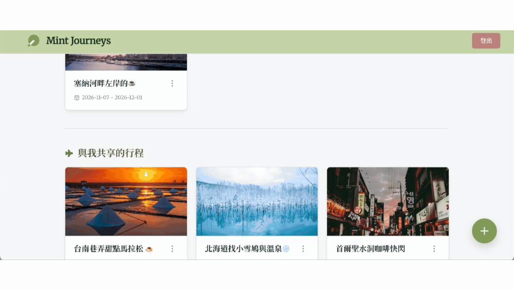

1. **編輯已建立的旅程** — 每個旅程資訊都可以編輯，更改資料、新增新的成員或是退出旅程。
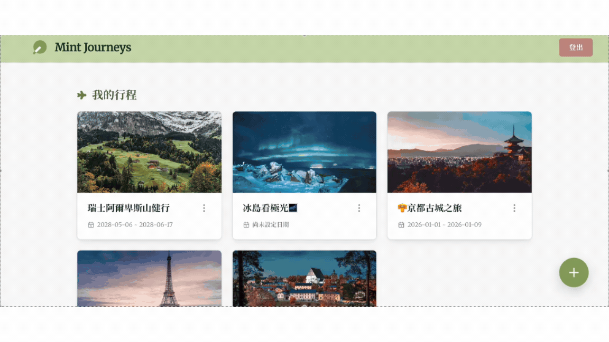

1. **新增消費紀錄** — 建立消費紀錄，包含消費金額、名稱、分類，亦可新增備註與圖片。
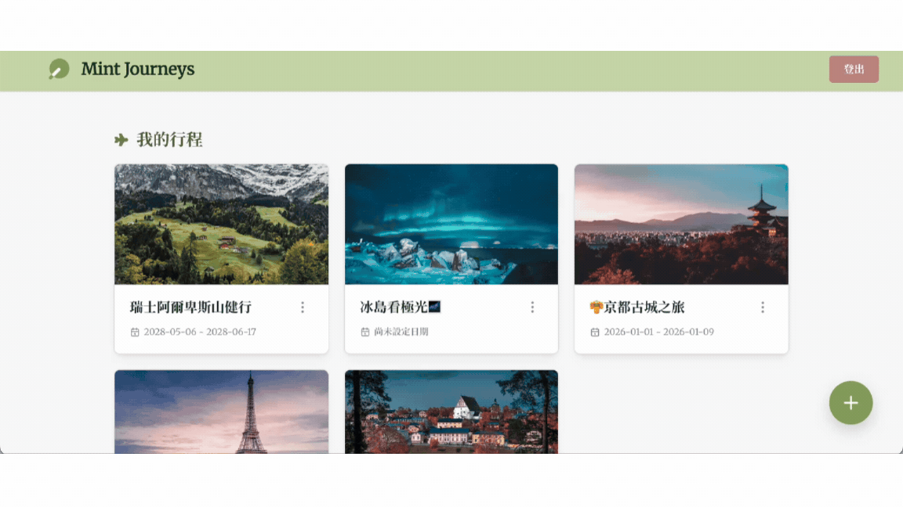

1. **查看過往消費紀錄** — 進入旅程頁面，可以看到過往的消費紀錄，點擊消費紀錄，即可展示詳細內容，亦可刪除紀錄。
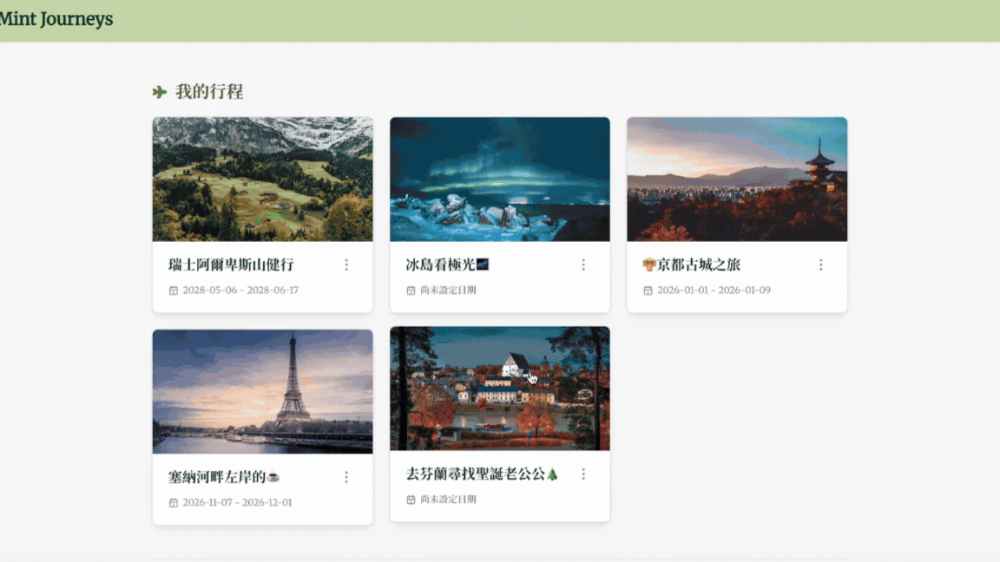

1. **進行消費紀錄分析** — 透過搜尋，可以依據「消費對象」、「消費時間」、「消費類別」進行消費分析，分別以圖表方式呈現。
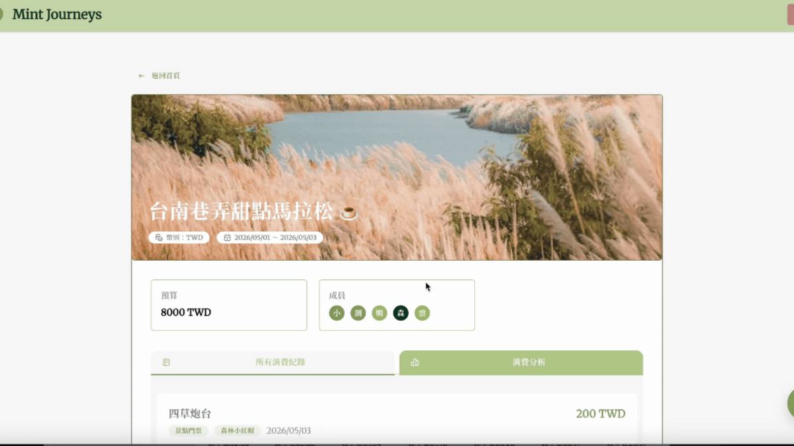

## ✨ 特色功能

- **共同編輯通知** — 使用者登入時，如果有被加進共享旅程，會收到通知。
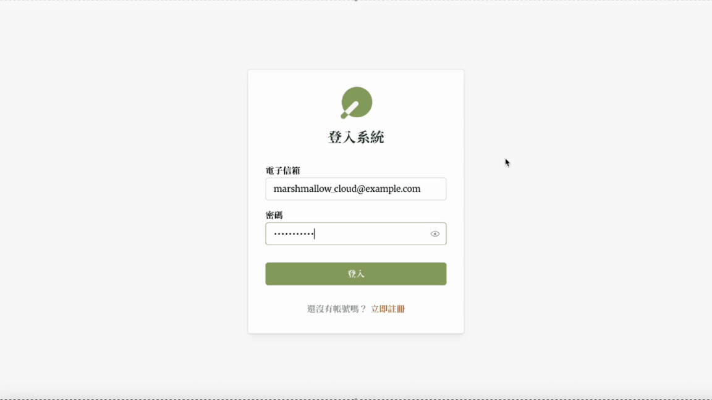

- **Email 格式驗證** — 新增共同編輯者時，先進行驗證，如果是不符合正確 Email 格式或是未註冊的 Email 信箱會先行通知，無法新增旅程。
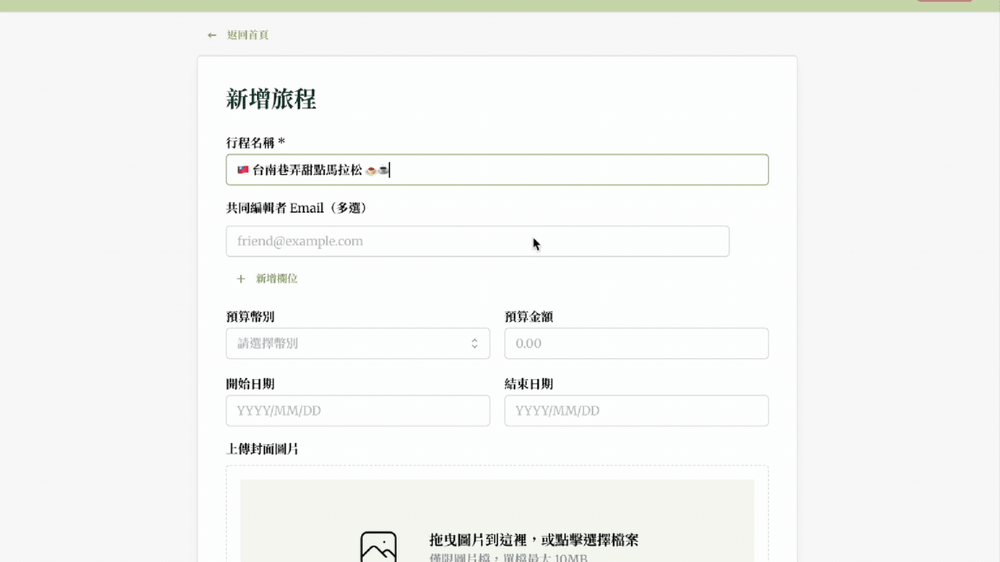

- **圖片上傳** — 旅程與消費紀錄皆支援圖片上傳功能。
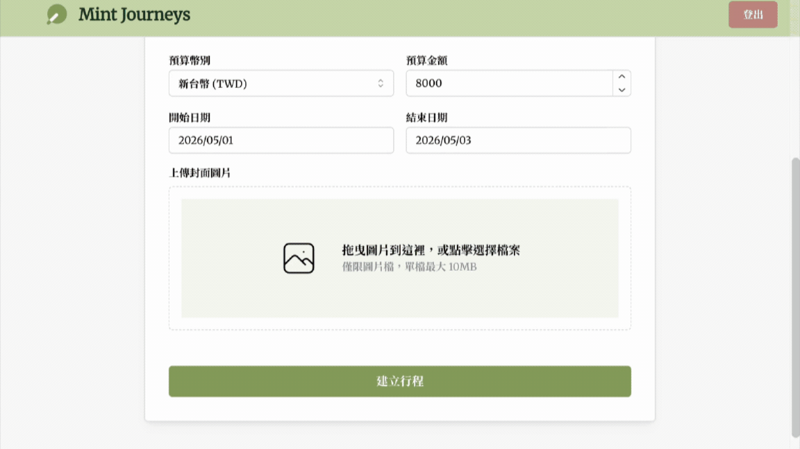

- **消費分析** — 可以針對「消費對象」、「消費時間」、「消費類別」進行消費分析。
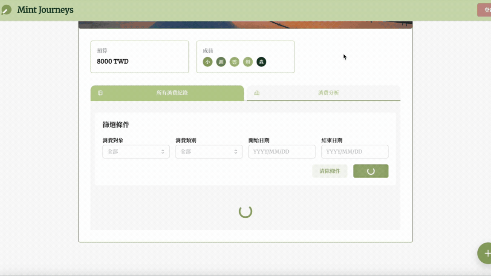


## 🛠 使用技術

### Frontend
- React
- TypeScript

### Backend
- Python
- FastAPI 
- SQLAlchemy
- JWT + bcrypt

### Database & Storage
- PostgreSQL
- AWS S3

### Deployment
- AWS EC2
- Nginx
- Docker、Docker Compose

## 🗂 系統架構圖

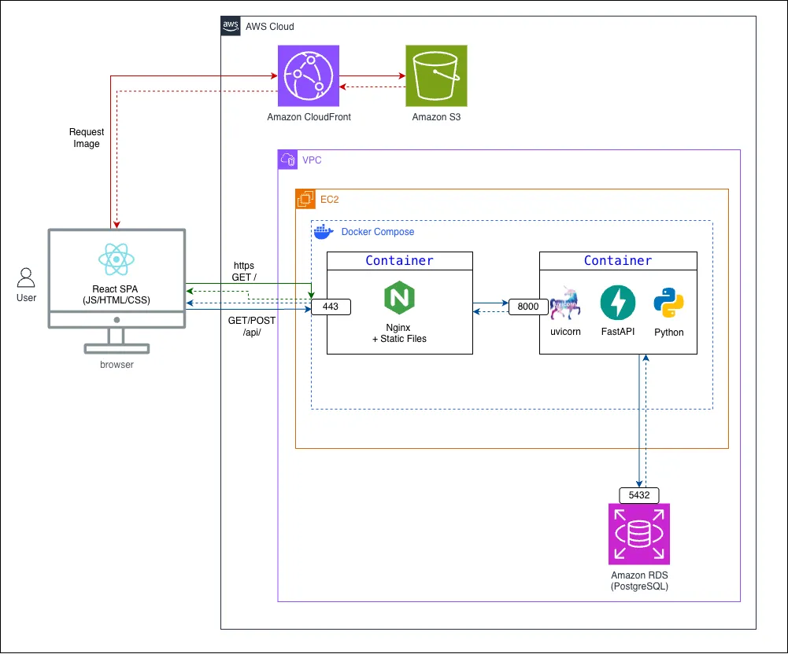

## 🗂 圖片上傳流程圖

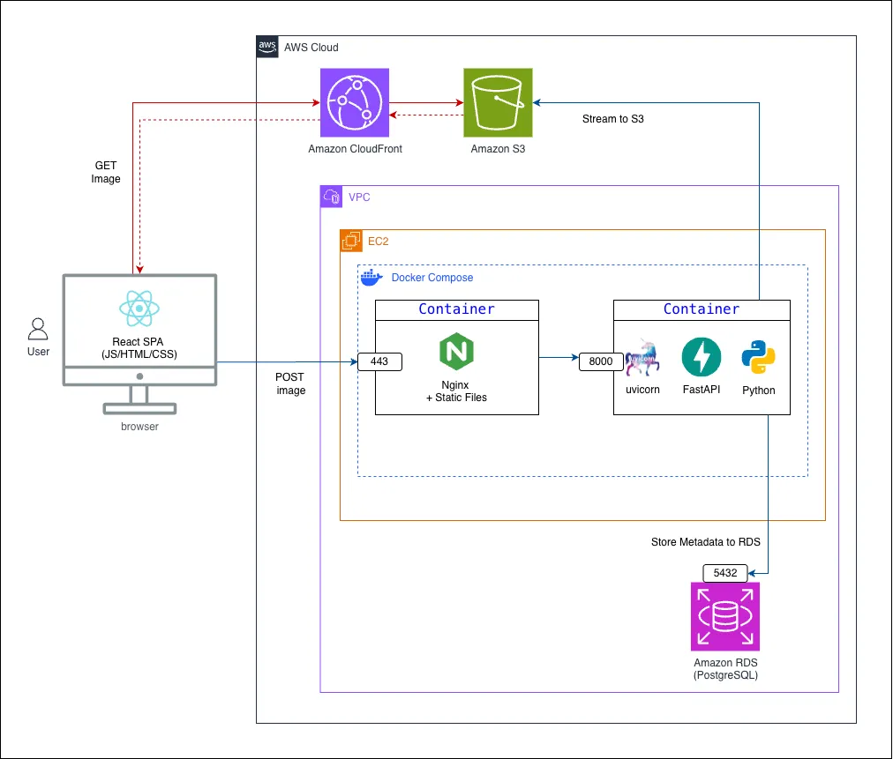

#### 🖼 使用者上傳圖片流程：
```
1. 使用者上傳圖片 ➡️ 2. 產生唯一圖片名稱 ➡️ 3. 壓縮並轉換為 WebP ➡️ 4. 上傳至 AWS S3 ➡️ 5. 儲存「圖片名稱」與「最後修改時間」至資料庫
```

## 🗂 資料庫關係圖

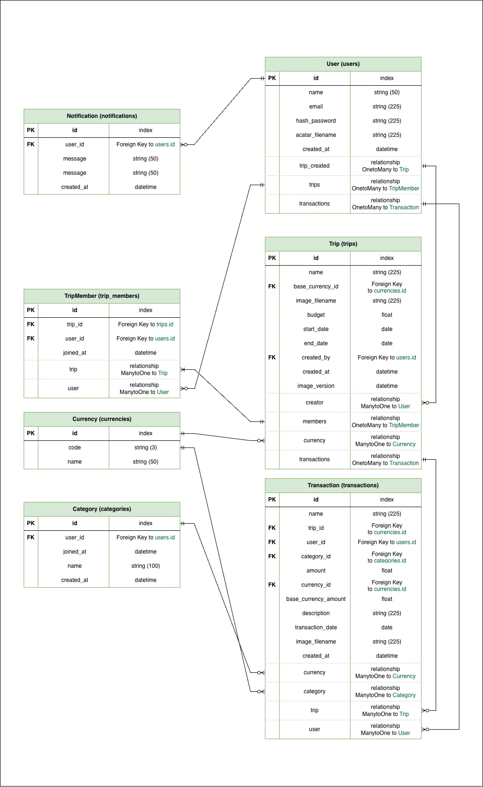

## 🗂 專案結構

```
mint-journeys/
├── frontend/
│   └── mint-journeys/
│       ├── public/
│       ├── src/
│       │   ├── main.tsx        # App 入口
│       │   ├── app.tsx         # App 初始化
│       │   ├── routes.tsx      # 路由設定
│       │   ├── pages/          # 頁面（核心功能）
│       │   │   ├── LoginPage.tsx              # 功能介紹登入畫面
│       │   │   ├── AppLayout.tsx              # header
│       │   │   ├── HomePage.tsx               # 顯示旅程總覽首頁
│       │   │   ├── AuthPage.tsx               # 會員註冊登入頁
│       │   │   ├── TripFormPage.tsx           # 旅程新增修改表格
│       │   │   ├── TripDetailPage.tsx         # 旅程畫面
│       │   │   ├── TransactionFormPage.tsx    # 新增交易表格
│       │   │   ├── TransactionDetailPage.tsx  # 詳細交易紀錄
│       │   │   └── ErrorPage.tsx              # 錯誤畫面
│       │   ├── styles/        # 主題顏色
│       │   └── assets/        # 圖片/影片檔
│       ├── package.json
│       ├── vite.config.ts
│       ├── nginx.conf
│       └── Dockerfile
│
├── backend/
│   ├── main.py                # API 服務 
│   ├── database.py            # 資料庫連線設定
│   ├── models
│   │   ├── table_models.py    # 資料庫設定
│   │   ├── schemas.py        
│   │   └── image_service.py   # 圖片上傳相關服務
│   ├── seed.py
│   ├── .env.example           # 環境變數範例
│   ├── requirements.txt
│   └── Dockerfile
│
└── docker-compose.yml
```


## 🚀 快速開始（本地開發）

### 環境需求

- [Docker](https://www.docker.com/) 與 Docker Compose

### 安裝與啟動

**1. 複製專案**

```bash
git clone https://github.com/shih3807/mint-journeys.git
cd mint-journeys
```

**2. 設定環境變數**

在 `backend/` 目錄下建立 `.env` 檔案（可參考.env.example）：

```env
# PostgreSQL
POSTGRES_USER=""
POSTGRES_PASSWORD=""
POSTGRES_DB=""
POSTGRES_HOST=""
POSTGRES_PORT=""

# JWT
TOKEN_SECRET=""

# AWS S3
AWS_S3_BUCKET_NAME=""
AWS_REGION=""
AWS_ACCESS_KEY_ID=""
AWS_SECRET_ACCESS_KEY=""

CLOUDFRONT_DOMAIN =""
```

**3. 啟動服務**

```bash
docker compose up --build
```

**4. 開啟瀏覽器**

前往 [http://localhost](http://localhost) 即可使用。

| 服務 | 位址 |
|------|------|
| 前端 | http://localhost |
| 後端 API | http://localhost:8000 |
| API 文件 | http://localhost:8000/docs |


## 💻 本地開發（不用 Docker）

### 前端

```bash
cd frontend/mint-journeys
npm install
npm run dev
```

### 後端
**1. 設定環境變數**

在 `backend/` 目錄下建立 `.env` 檔案（可參考.env.example）：

```env
# PostgreSQL
POSTGRES_USER=""
POSTGRES_PASSWORD=""
POSTGRES_DB=""
POSTGRES_HOST=""
POSTGRES_PORT=""

# JWT
TOKEN_SECRET=""

# AWS S3
AWS_S3_BUCKET_NAME=""
AWS_REGION=""
AWS_ACCESS_KEY_ID=""
AWS_SECRET_ACCESS_KEY=""

CLOUDFRONT_DOMAIN =""
```

**2. 啟動 uvicorn**
```bash
cd backend
pip install -r requirements.txt
uvicorn main:app --reload
```

### 開啟瀏覽器

| 服務 | 位址 |
|------|------|
| 前端 | http://localhost:5173 |
| 後端 API | http://localhost:8000 |
| API 文件 | http://localhost:8000/docs |

